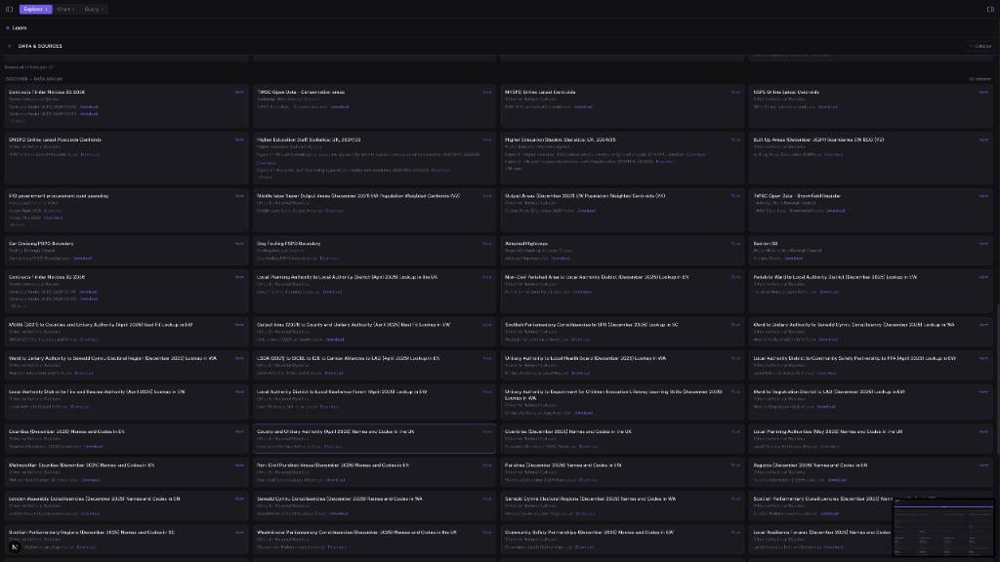
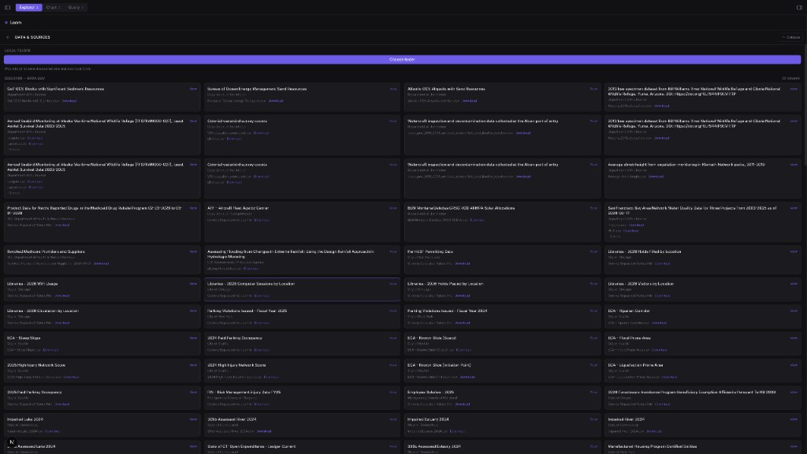

# Loom — Data Storyteller

**Local-first data storytelling for macOS.** Mount a folder, query millions of rows via DuckDB, and build charts with Vega-Lite and WebGPU. Discover data with heuristic and AI suggestions, tweak encodings in the panel, and export as PNG or SVG.

**Contributors & AI agents:** See [DOCS.md](DOCS.md) for architecture and [AGENTS.md](AGENTS.md) for a concise repo map and conventions.

---

## What it does

### Explorer
- **Mount a folder** — Point at a directory of CSV/Parquet files; Loom scans and exposes them in the sidebar. Search files by name.
- **Data table** — Virtualized table with sort, column reorder (drag headers), show/hide columns, per-column text and range filters. Sparklines, value bars, heat tint, trend cues, and null % in headers. Date columns auto-formatted.
- **Row selection** — Checkboxes, keyboard (↑/↓ + Space). Export selected rows to CSV. **Saved views** store column visibility, order, and filters; **Undo/Redo** for table layout.
- **Linked highlighting** — Hover a row in the table to highlight the corresponding point on the chart (and vice versa via scatter hover).
- **Column profiling** — Right-click a column header for a quick profile: null %, unique count, min/max/median, distribution histogram, top values.

### Chart
- **Chart view** — Pick a file, get instant chart suggestions (bar, line, scatter, area, pie, heatmap, strip, box). Click a suggestion or use **Suggest with AI** (Ollama).
- **Encode your way** — X, Y, Color, Size, Row; plus **Glow by**, **Outline by**, **Opacity by**. Bar stacking: grouped, stacked, or 100% stacked. Scatter: connect points (trail), marginal distributions.
- **Visual controls** — Typography (font, title weight, tick rotation), marks (shape, outline, jitter, bar radius, line style, smooth curve), axes and grid, layout (padding, legend, data labels), atmosphere (background, blend, glow, entrance animation). **Responsive** — compact padding and smaller type when the panel is narrow.
- **Interactivity** — **Pan** (drag) and **zoom** (wheel) on scatter. **Brush** (Shift+drag) or **Lasso** (freeform polygon) to select points and sync to table selection. **Crosshair** mode shows live (x, y) and ruler pins for Δx/Δy. **Tooltip pinning** — click a point to pin its tooltip. **Mini-map** when zoomed. **Custom reference lines** from the Chart panel.
- **Smart tab** — **Anomaly** (Z-score, IQR, MAD), **Forecast**, **Trend line**, **Reference lines**, **Clustering**, and **Correlation matrix** (pairwise Pearson heatmap). Overlays draw on the chart; filter table to anomalies.
- **Export** — Copy or download PNG/SVG; copy chart config as JSON. Annotations and custom ref lines are per chart.

### Query
- **SQL editor** — Run DuckDB SQL against `loom_active`. Schema browser (Tables + Columns) and click-to-insert. **Validation** (parentheses, SELECT/WITH) before run.
- **Results** — Paginated grid, copy cell/row, export CSV. **Query history** and **snippets** (save/load named SQL). **Snapshot** current result and **Diff** vs a snapshot (row count delta).
- **NL-to-SQL** — Plain-language input (e.g. “show me sales by region”); scaffold query with schema context (full generation via Ollama when available).

### App
- **Theming** — Dark, light, high-contrast, colorblind; font scale; reduced motion. Tokens in `globals.css`.
- **Onboarding** — First-run modal: add data, then explore.
- **Data & sources** — Data.gov / data.gov.uk recent CSVs (Tauri), save CSV to folder, **Wikipedia live stream** (SSE → `wiki_stream`), and **poll-based feeds** (USGS earthquakes, Open-Meteo weather, NWS alerts, World Bank indicators) with sidebar cards and Query-view SQL against virtual `stream://…` sources.

---

## Screenshots

Place screenshots in `docs/screenshots/` and reference them below. See [docs/screenshots/README.md](docs/screenshots/README.md) for how to capture.

| Explorer (table) | Chart view |
|------------------|------------|
|  |  |

| Query + results | Data & sources |
|-----------------|----------------|
|  |  |

*If the image files are missing, run the app, capture screenshots as described in `docs/screenshots/README.md`, and add them to the repo.*

---

## Quick start

### Prerequisites

- **macOS 14+** (Sonoma) with Apple Silicon recommended
- **Rust** 1.75+ (`rustup`)
- **Node.js** 20+ (e.g. `nvm`)
- **Tauri CLI**: `cargo install tauri-cli`
- **Docker** (optional, for containerized web UI)

### First time

```bash
make setup    # install npm + cargo deps
make spool    # generate sample data in .loom-data
make spin     # launch Loom (Tauri + Next.js + optional Ollama)
```

Then **Choose folder** → pick `.loom-data` (or any folder with CSV/Parquet), select a file, and switch to **Chart** to see suggestions.

---

## Command reference (the Loom)

Run `make` (or `make help`) to list all commands. Every target uses a weaving metaphor.

### Develop

| Command | Description |
|--------|-------------|
| `make spin` | Full dev: Tauri + Next.js hot reload; starts Ollama in background if available |
| `make thread` | Frontend-only dev (no Rust) — good for UI work and web-only testing |
| `make warp` | Rust backend type-check only (`cargo check`) |
| `make setup` | First-time: install npm deps and fetch Rust deps |

### Build

| Command | Description |
|--------|-------------|
| `make weave` | Production build → `.app` bundle |
| `make weave-web` | Static web export only (output in `./out`) |
| `make weave-rust` | Rust release binary only |

### Data

| Command | Description |
|--------|-------------|
| `make spool` | Generate sample datasets (10K–1M rows) in `.loom-data` |
| `make spool-small` | Small test set (1K rows) |
| `make spool-mega` | Stress test (5M rows, ~500MB) |

### Docker

| Command | Description |
|--------|-------------|
| `make shuttle` | Build and run web UI in Docker |
| `make shuttle-build` | Build Docker image only |
| `make shuttle-down` | Stop containers |
| `make shuttle-shell` | Shell into running container |

### Quality

| Command | Description |
|--------|-------------|
| `make test` | Run unit tests (Vitest) |
| `make check` | Run all checks (TypeScript + Rust) |
| `make check-ts` | TypeScript type-check + lint |
| `make check-rust` | Rust check + clippy |
| `make fmt` | Format code (Prettier + rustfmt) |

### Cleanup

| Command | Description |
|--------|-------------|
| `make unspool` | Remove generated `.loom-data` |
| `make unravel` | Deep clean (node_modules, .next, out, targets, data) |
| `make tidy` | Light clean (build caches only) |

All of these are also exposed as npm scripts: `npm run spin`, `npm run weave`, `npm run spool`, etc.

---

## Ollama (optional) — AI chart suggestions

To use **Suggest with AI** in the Chart view:

1. Run Ollama and pull a model:
   ```bash
   ollama serve
   ollama pull llama3.2
   ```
2. Optional env (`.env.local` or shell):
   - `NEXT_PUBLIC_OLLAMA_URL` — default `http://localhost:11434`
   - `NEXT_PUBLIC_OLLAMA_MODEL` — default: first available or `llama3.2`
3. If the app can’t reach Ollama (e.g. CORS), allow origins:
   ```bash
   OLLAMA_ORIGINS="*" ollama serve
   ```
   Or set `OLLAMA_ORIGINS` to your dev URL (e.g. `http://localhost:1337`).

Hover **Why?** on a suggestion to see the reason (heuristic or AI).

---

## Architecture

```
┌──────────────────────────────────────────────────────────────────┐
│  Tauri Shell (Rust)                                              │
│  ┌──────────────┐  ┌──────────────┐  ┌─────────────────────────┐ │
│  │  tauri-fs     │  │  DuckDB      │  │  reqwest (Data.gov,     │ │
│  │  (folder I/O) │  │  (analytics) │  │   save CSV to folder)   │ │
│  └──────┬───────┘  └──────┬───────┘  └───────────┬─────────────┘ │
│         │  IPC (invoke)   │                        │              │
├─────────┼─────────────────┼────────────────────────┼──────────────┤
│  Frontend (Next.js + TypeScript)                                 │
│  ┌──────┴───────┐  ┌──────┴───────┐  ┌─────────────┴───────────┐ │
│  │  Zustand     │  │  Vega-Lite   │  │  WebGPU / Canvas 2D       │ │
│  │  (state)     │  │  (spec gen)  │  │  (scatter + bar/line/…)  │ │
│  └──────────────┘  └──────────────┘  └──────────────────────────┘ │
└──────────────────────────────────────────────────────────────────┘
```

- **Vega-Lite (brain)** — Declares *what* to draw as portable JSON specs; used for export and for non-WebGPU marks.
- **WebGPU / Canvas (muscle)** — Renders scatter at scale; other mark types use Canvas 2D or Vega headless where appropriate.

---

## Project structure

```
Loom_story_teller/
├── src-tauri/                  # Rust backend
│   ├── Cargo.toml               # DuckDB, Tauri, reqwest, etc.
│   ├── tauri.conf.json          # Window, plugins, CSP
│   ├── capabilities/            # Tauri v2 permissions
│   └── src/
│       ├── lib.rs               # Plugin init, command registration, DB + stream + sources state
│       ├── main.rs              # Binary entry
│       ├── db.rs                # DuckDB: scan, query, column stats
│       ├── stream.rs            # Wikipedia SSE → wiki_stream
│       ├── sources.rs           # USGS, Open-Meteo, NWS, World Bank → DuckDB tables
│       └── commands.rs          # All #[tauri::command] handlers (see tauri.ts)
│
├── src/                         # Next.js frontend
│   ├── app/
│   │   ├── layout.tsx           # Root layout, fonts, globals
│   │   └── page.tsx             # Three-panel layout (Sidebar | Main | DetailPanel)
│   ├── components/
│   │   ├── Sidebar.tsx          # Files, Data & sources, live stream + poll source cards
│   │   ├── TopBar.tsx           # View tabs (Explorer / Chart / Query)
│   │   ├── DetailPanel.tsx      # Right panel: Stats, Chart (encoding + Visual), Export, Smart
│   │   ├── ChartView.tsx       # Chart canvas, suggestions, Smart overlays, title edit, export
│   │   ├── ChartCard.tsx        # Thumbnail + “Try” for suggestions
│   │   ├── ExplorerView.tsx    # Full-width data table
│   │   ├── QueryView.tsx       # SQL editor + results
│   │   └── PreviewFooter.tsx   # Collapsible preview + Schema (drag tokens)
│   ├── lib/
│   │   ├── store.ts             # Zustand state
│   │   ├── tauri.ts             # Typed IPC bridge (invoke wrappers)
│   │   ├── vega.ts              # Vega-Lite spec builders
│   │   ├── webgpu.ts            # WebGPU pipeline (scatter)
│   │   ├── recommendations.ts  # Heuristics + recommendStreamStory / recommendSourceStory + SQL snippets
│   │   ├── ollama.ts            # Ollama API for AI suggestions
│   │   ├── mock-data.ts         # Browser fallbacks when not in Tauri
│   │   ├── format.ts            # Number/byte formatting
│   │   ├── chartPalettes.ts     # Chart color palettes
│   │   └── smartAnalytics.ts   # Anomaly, forecast, trend, reference lines, clustering
│   ├── shaders/
│   │   └── scatter.wgsl         # Compute + vertex + fragment
│   └── styles/
│       └── globals.css          # Design tokens, theme
│
├── scripts/
│   └── generate_data.py         # Sample data (scatter, sales, timeseries)
├── docs/
│   └── screenshots/            # Screenshots for README
├── Makefile                     # Command Loom (run `make` for help)
├── Dockerfile                   # Web UI container
├── docker-compose.yml
├── next.config.mjs              # Static export for Tauri
├── tailwind.config.ts          # Token-linked theme
└── package.json
```

See [DOCS.md](DOCS.md) for a deeper codebase map and conventions.

---

## Design system

Visual design is token-based in `src/styles/globals.css`:

| Token | Dark default | Purpose |
|-------|--------------|---------|
| `--loom-bg` | `#0a0a0c` | Page background |
| `--loom-surface` | `#111114` | Cards, panels |
| `--loom-elevated` | `#1a1a1f` | Hover, inputs |
| `--loom-border` | `#2a2a30` | Borders |
| `--loom-text` | `#e8e8ec` | Primary text |
| `--loom-muted` | `#6b6b78` | Secondary text |
| `--loom-accent` | `#6c5ce7` | Accent (purple) |
| `--chart-1` … `--chart-8` | (palette) | Chart colors |

Component classes: `.loom-panel`, `.loom-card`, `.loom-btn-primary`, `.loom-btn-ghost`, `.loom-input`, `.loom-badge`. To reskin the app, change token values in `globals.css`.

---

## IPC command reference

Frontend calls go through `src/lib/tauri.ts`; do not use raw `invoke()`.

| Command | Args | Returns |
|---------|------|--------|
| `scan_folder` | `{ folderPath: string }` | `FileEntry[]` |
| `query_file` | `{ filePath, sql, limit? }` | `QueryResult` |
| `get_column_stats` | `{ filePath: string }` | `ColumnInfo[]` |
| `get_sample_rows` | `{ filePath, limit? }` | `QueryResult` |
| `inspect_file` | `{ filePath, limit? }` | `InspectResult` (stats + sample) |
| `save_csv_to_folder` | `{ folder_path, url, filename }` | `string` (saved path) |
| `fetch_data_gov_recent_csv` | `{ rows?: number }` | `DataGovDataset[]` |
| `stream_*` | (see `tauri.ts`) | Wikipedia SSE ingest → `wiki_stream` |
| `source_*` | `kind: usgs \| meteo \| nws \| world_bank` | Poll-based APIs → per-source tables |

Full signatures live in `src/lib/tauri.ts` and Rust in `src-tauri/src/commands.rs`.

---

## WebGPU pipeline (scatter)

WebGPU is used for scatter only when the mark is **circle**, there is no outline/jitter/glow or data-driven glow/outline/opacity encoding, and **no Smart overlays** (anomaly, trend, forecast, reference lines, clustering). When any of those are active, scatter uses Canvas 2D so overlays and encodings render correctly.

```
CPU: Float32Array (x, y, category, size_norm)
  → upload to GPU storage buffer
  → compute_positions (workgroups) × size_scale
  → screen-space coords + color
  → vertex_main (instanced quads)
  → fragment_main (circle + soft edge)
  → framebuffer
```

Shaders: `src/shaders/scatter.wgsl`. Palette aligns with `--chart-*` in CSS. **Size scale** (0.5–2×) multiplies size-encoded point radius in the shader.

---

## Milestones

- **M1 (Core)** — Folder → DuckDB → WebGPU scatter. Target: 1M+ points at 60fps.
- **M2 (Skin)** — WebGPU texture → MLX sidecar for AI-styled charts (Apple Silicon).
- **M3 (Share)** — Bundle spec + assets for governed story sharing.

---

## Build notes

- **vega-canvas warning** — Next.js may report `Module not found: Can't resolve 'canvas'` from `vega-canvas`. This is an optional native dependency used by Vega in Node; the browser build works without it. You can ignore the warning or add `canvas` as an optional dependency if you run Vega in Node.

---

## Key decisions

1. **Static export** — Tauri expects a static frontend; `next.config.mjs` uses `output: "export"`. No server-side API routes at runtime.
2. **In-process DB** — DuckDB runs inside the Rust process; no separate database server.
3. **Vega-Lite as spec** — Charts are declarative JSON, so they’re auditable and LLM-friendly; used for export (SVG) and for non-WebGPU marks.
4. **WebGPU for scatter** — High-density scatter uses compute shaders; other marks use Canvas 2D or Vega as needed.
5. **Zustand** — Single store for UI and cached results; avoids Context re-render chains.
6. **Data.gov in Rust** — Data.gov “recent CSV” is fetched by a Tauri command (reqwest) so it works without a Next.js API route.
