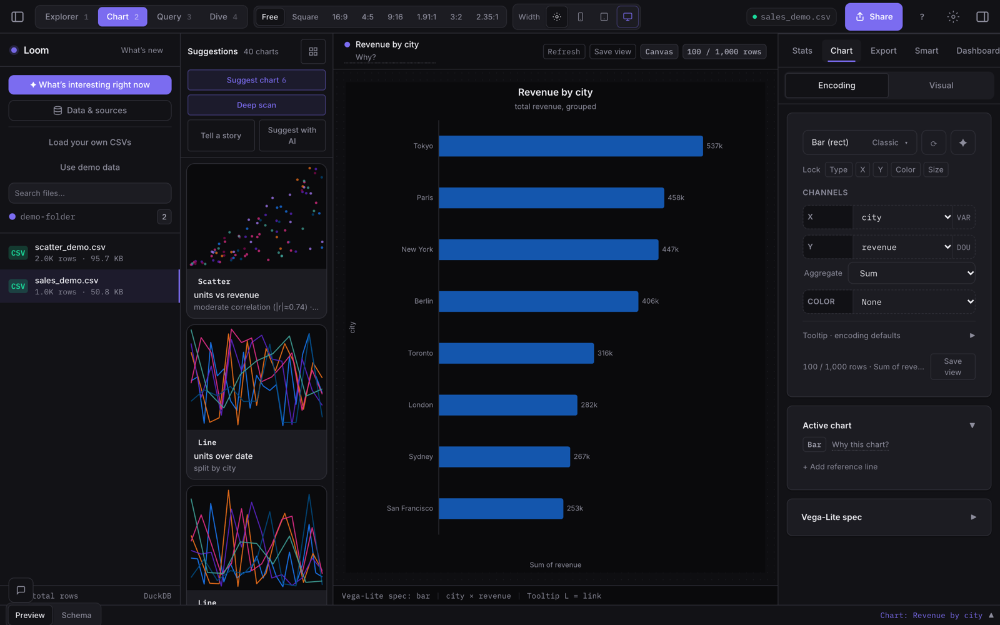
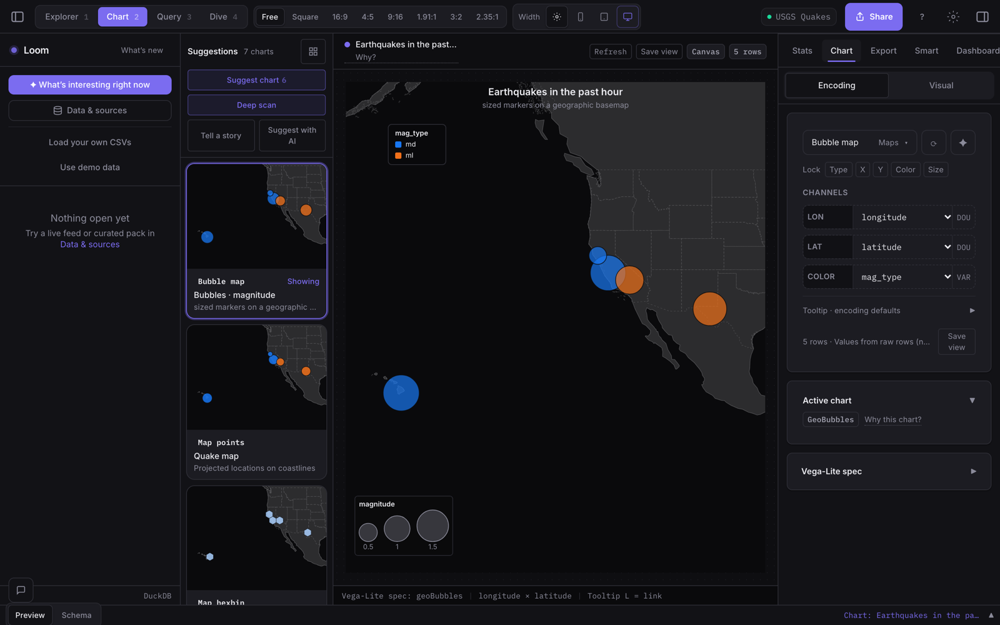
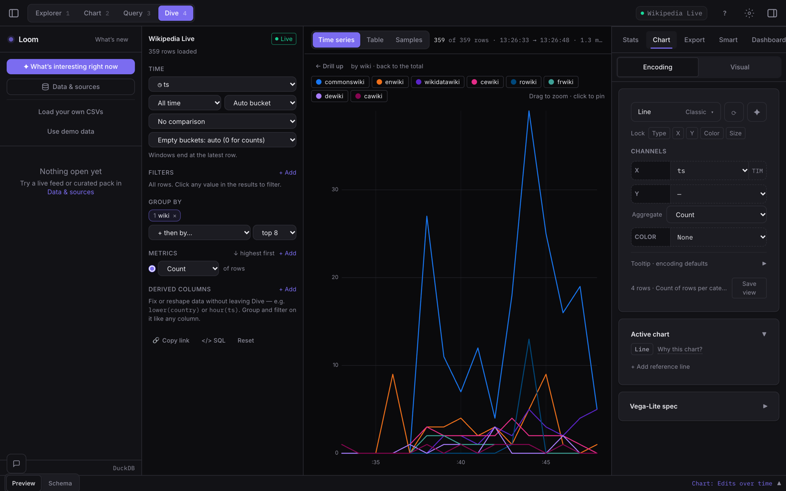
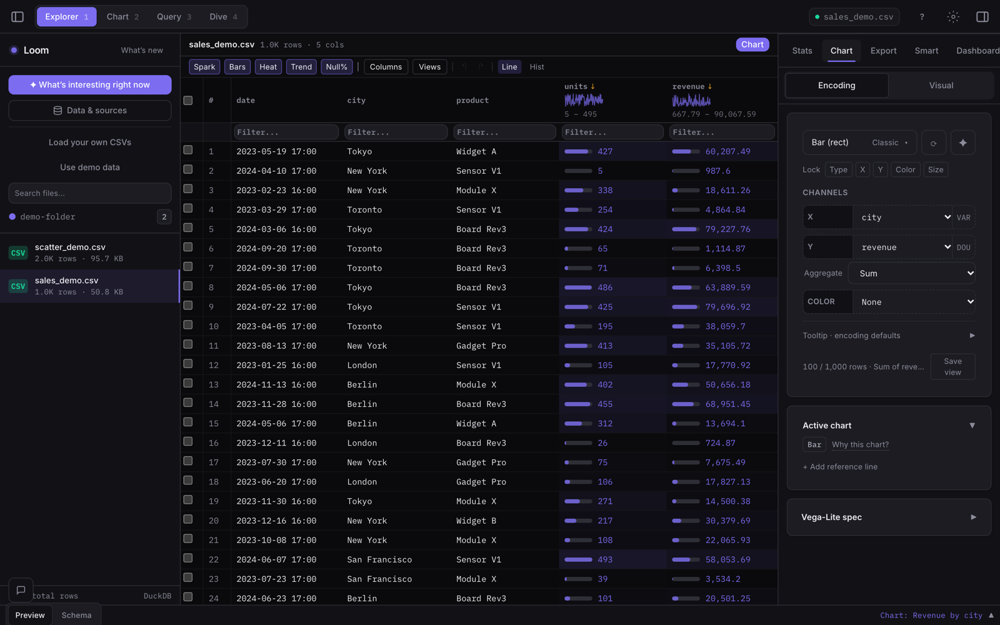
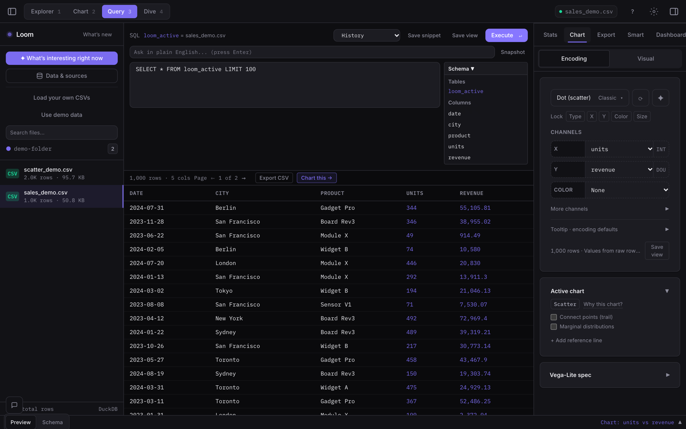
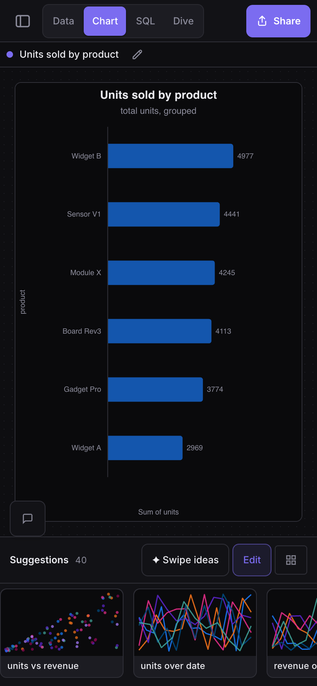

# Loom — Data Storyteller

**Find interesting data, turn it into a readable chart, and share it — in your browser, on your phone, or as a macOS app.**

**▶ Try it: [loom.ibm.io](https://loom.ibm.io)** — no install. Live earthquakes, flights, Wikipedia edits, crypto, and weather are one click away, or load your own CSVs.



The desktop app (Tauri + DuckDB) adds folder mounting, millions of rows, SQL over CSV/Parquet, and WebGPU scatter. Charts are Vega-Lite specs drawn on Canvas / WebGPU; export PNG, SVG, or a link that reopens the exact chart.

**Contributors & AI agents:** See [DOCS.md](DOCS.md) for architecture and [AGENTS.md](AGENTS.md) for a concise repo map and conventions.

---

## What it does

### On your phone (web)
- **Find something fun** — first open (and every empty view) leads with **✦ What’s interesting right now**: Loom scans the live feeds (quakes, flights, Hacker News, Wikipedia, crypto, weather…) and opens the best one as a chart with its headline already set. **Data & sources** puts live feeds and curated packs first.
- **Make it yours** — **Edit** opens a half-height sheet so the chart stays visible while you change encoding or look; **✦ Swipe ideas** deals more charts to Keep / Skip. Bars flip horizontal on tall screens so long labels stay readable; taps show tooltips and finger-drags scrub them.
- **Share** — the **Share** button renders the chart at Square / Portrait / Story / Wide sizes with feed-sized type, then opens the phone’s share sheet (or saves the image). **Get link** publishes a chart page that unfurls with a preview image in iMessage, Slack, X, etc. (kept 7 days). **Copy chart link** (and the address bar in Chart view, `#chart=…`) reopens the exact chart — dataset, chart type, encodings, headline, look, and framing; live feeds, demo files, and open-data CSVs reopen on load, local files wait for the recipient to open a file with the same name.

### Explorer
- **Mount a folder** — Point at a directory of CSV/Parquet files; Loom scans and exposes them in the sidebar. Search files by name.
- **Data table** — Virtualized table with sort, column reorder (drag headers), show/hide columns, per-column text and range filters. Sparklines, value bars, heat tint, trend cues, and null % in headers. Date columns auto-formatted.
- **Row selection** — Checkboxes, keyboard (↑/↓ + Space). Export selected rows to CSV. **Saved views** store column visibility, order, and filters; **Undo/Redo** for table layout.
- **Linked highlighting** — Hover a row in the table to highlight the corresponding point on the chart (and vice versa via scatter hover).
- **Column profiling** — Right-click (or long-press) a column header for a quick profile: null %, unique count, min/max/median, distribution histogram, top values.

### Chart
- **Chart view** — Pick a file, get instant chart suggestions (bar, line, scatter, area, pie, heatmap, strip, box). Click a suggestion or use **Suggest with AI** (Ollama).
- **Readable by default** — Axes tick at round numbers with gridlines on the same values; dates read as months and years. Category names are never chopped: bars turn sideways when names won’t fit, crowded axes angle or thin their labels. Hover any bar, slice, bin, or cell for its actual value. One color unless Color encodes a field — then a legend appears in the emptiest corner. Heatmap, hexbin, and map ramps work in light and dark themes.
- **Encode your way** — X, Y, Color, Size, Row; plus **Glow by**, **Outline by**, **Opacity by**. Bar stacking: grouped, stacked, or 100% stacked. Scatter: connect points (trail), marginal distributions.
- **Visual controls** — Typography (font, title weight, tick rotation), marks (shape, outline, jitter, bar radius, line style, smooth curve), axes and grid, layout (padding, legend, data labels), atmosphere (background, blend, glow, entrance animation). **Responsive** — compact padding and smaller type when the panel is narrow.
- **Interactivity** — **Pan** (drag) and **zoom** (wheel) on scatter. **Brush** (Shift+drag) or **Lasso** (freeform polygon) to select points and sync to table selection. **Crosshair** mode shows live (x, y) and ruler pins for Δx/Δy. **Tooltip pinning** — click a point to pin its tooltip. **Mini-map** when zoomed. **Custom reference lines** from the Chart panel.
- **Smart tab** — **Anomaly** (Z-score, IQR, MAD), **Forecast**, **Trend line**, **Reference lines**, **Clustering**, and **Correlation matrix** (pairwise Pearson heatmap). Overlays draw on the chart; filter table to anomalies.
- **Data cube 3D** — Pick **Rows**, **Columns**, and **Depth** (any column type: categories, numbers, dates are binned to ≤12 slots) plus an optional **Value** with Sum / Average / Min / Max (default: row count). Each non-empty cell is a voxel sized and colored by its value. Drag to orbit, scroll to zoom, hover a voxel for its row · column · depth and value. Renders with WebGPU when available (Canvas 2D fallback for exports and thumbnails).
  - **Pivot it** — drag the **Rows / Columns / Depth** chips onto each other (or click two, or **↻ Pivot** to rotate all three) and the voxels fly to their new positions; drop a Schema column on a chip to replace that axis. **Slice** a depth layer with ◀ ▶, `[` / `]`, or by clicking a voxel (other layers ghost; Esc for all). **▦ Table** docks a linked pivot table (rows × columns for the slice, or rolled up across depth, with row / column / grand totals) — hover a cell to light its voxels.
- **Export** — Copy or download PNG/SVG; copy chart config as JSON. Annotations and custom ref lines are per chart.

### Dive (Scuba-style slice and dice)
- **Ask questions by clicking** — pick a **time window** (last 15 min → last year, ending at the newest row, or **Custom** with absolute or relative bounds like `-3 hours` / `yesterday`), **filters**, **group by** (nested), and **metrics** (count, count distinct, sum, avg, min, max, **p5 … p99.9**; min / max / avg also work on time columns as first / last seen). Results update instantly.
- **Filters** — multi-value chips with suggestions from the data (= ORs them, ≠ excludes them all), contains, LIKE, and regex.
- **Derived columns** — define a column with a DuckDB-style expression (`hour(ts)`, `lower(country)`, `CASE WHEN … END`, `regexp_extract(…)`) and filter / group / aggregate on it. Evaluated in the browser; the same text goes into the SQL preview.
- **Three views of one query** — **Time series** (auto, fine, or fixed buckets from 1 s to 30 days; one line per top group; one panel per metric; empty buckets as 0, gaps, or connected), **Table** (ranked groups with totals, hits + share, highest- or lowest-first), **Samples** (newest matching raw rows, pick columns, sort by any header).
- **Compare** with the previous period, 1 day, 1 week, or 4 weeks earlier — dashed ghost lines and green/red % deltas.
- **Drill in** — click any value to filter to it (and stop grouping by it); ⌥-click to exclude it. On the chart: **Break down by** / **Drill up**, hover highlights the nearest line, click pins the crosshair, **drag to zoom** (double-click to zoom out).
- **History** — each change is a browser history step, so Back / Forward walk through your queries.
- **Live** — on Wikipedia / USGS / NWS and other feeds the dive auto-refreshes.
- **Share** — the whole query lives in the URL (`#dive=…`); links to live feeds and demo files reopen the dataset on load. **SQL** shows the equivalent DuckDB query (open it in Query on desktop). **Open as cube** sends the filtered rows to the Data cube.
- Works on web and desktop: the engine runs in the browser over the loaded rows (desktop pulls a 30k-row DuckDB sample first; web streams use their 8k-row buffer; uploaded CSVs on web use the 500-row sample).

### Query
- **SQL editor** — Run DuckDB SQL against `loom_active`. Schema browser (Tables + Columns) and click-to-insert. **Validation** (parentheses, SELECT/WITH) before run.
- **Results** — Paginated grid, copy cell/row, export CSV. **Query history** and **snippets** (save/load named SQL). **Snapshot** current result and **Diff** vs a snapshot (row count delta).
- **NL-to-SQL** — Plain-language input (e.g. “show me sales by region”); scaffold query with schema context (full generation via Ollama when available).

### App
- **Theming** — Dark, light, high-contrast, colorblind; font scale; reduced motion. Tokens in `globals.css`.
- **Onboarding** — First-run modal: add data, then explore.
- **Data & sources** — Data.gov / data.gov.uk **catalog search**, **sort**, **larger result sets** (up to 200), and a quick **page filter** (Tauri); save CSV to folder; **Wikipedia live stream** (SSE → `wiki_stream`); **22 live and poll feeds** in five groups — *Earth & climate* (USGS quakes, NASA natural events, NWS alerts, weather and air quality for 12 cities, UK grid carbon, global temperature since 1880), *Cities & transport* (live aircraft, Citi Bike docks, NYC 311), *Space* (ISS, upcoming launches, SpaceX history, NOAA space weather), *Web & markets* (Hacker News, Wikipedia most-read, crypto, 90 days of FX), *Countries & history* (FEMA, COVID, countries, World Bank) — each opens with charts picked for it and has Query-view SQL against virtual `stream://…` sources. **Curated packs** load whole public CSVs: OWID CO₂, life expectancy, GDP, renewables, and population; the Keeling curve; every confirmed exoplanet; 35k power plants; US cities.

---

## Screenshots

All captured from [loom.ibm.io](https://loom.ibm.io) — each chart opens from a shareable `#chart=` / `#dive=` link.

| Live earthquakes on a map | Dive: Wikipedia edits by wiki |
|---|---|
|  |  |

| Explorer | Query |
|---|---|
|  |  |

<p align="center"></p>

How these were captured (and how to refresh them): [docs/screenshots/README.md](docs/screenshots/README.md).

---

## Quick start

### Prerequisites

- **macOS 14+** (Sonoma) with Apple Silicon recommended
- **Rust** 1.75+ (`rustup`)
- **Node.js** 20+ (e.g. `nvm`)
- **Tauri CLI**: `cargo install tauri-cli`
- **Docker** (optional, for containerized web UI)

### First time

```bash
make setup    # install npm + cargo deps
make spool    # generate sample data in .loom-data
make spin     # launch Loom (Tauri + Next.js + optional Ollama)
```

Then **Choose folder** → pick `.loom-data` (or any folder with CSV/Parquet), select a file, and switch to **Chart** to see suggestions.

---

## Command reference (the Loom)

Run `make` (or `make help`) to list all commands. Every target uses a weaving metaphor.

### Develop

| Command | Description |
|--------|-------------|
| `make spin` | Full dev: Tauri + Next.js hot reload; starts Ollama in background if available |
| `make thread` | Frontend-only dev (no Rust) — good for UI work and web-only testing |
| `npx wrangler dev --port 8787` + `LOOM_DEV_API=http://localhost:8787 npm run dev` | Web dev with the Worker’s `/api/*` + `/s/*` (live feeds, catalog search, share links) proxied locally |
| `make warp` | Rust backend type-check only (`cargo check`) |
| `make setup` | First-time: install npm deps and fetch Rust deps |

### Build

| Command | Description |
|--------|-------------|
| `make weave` | Production build → `.app` bundle |
| `make weave-web` | Static web export only (output in `./out`) |
| `make weave-rust` | Rust release binary only |

### Data

| Command | Description |
|--------|-------------|
| `make spool` | Generate sample datasets (10K–1M rows) in `.loom-data` |
| `make spool-small` | Small test set (1K rows) |
| `make spool-mega` | Stress test (5M rows, ~500MB) |

### Docker

| Command | Description |
|--------|-------------|
| `make shuttle` | Build and run web UI in Docker |
| `make shuttle-build` | Build Docker image only |
| `make shuttle-down` | Stop containers |
| `make shuttle-shell` | Shell into running container |

### Cloud (Cloudflare)

| Command | Description |
|--------|-------------|
| `make loft` | Build static export and deploy to Cloudflare Workers |
| `make loft-mcp` | Deploy Loom MCP / ChatGPT plugin Worker |
| `make loft-dry` | Same build, dry-run deploy (no upload) |
| `make thread-mcp` | Local MCP Worker on :8787 |

Hosted at **[loom.ibm.io](https://loom.ibm.io)** — the browser web UI. Live feeds (USGS, Wikipedia, NWS, weather, flights, crypto, Hacker News…), catalog discovery (Data.gov / UK), and published story links run through the Cloudflare Worker (`workers/catalog-proxy.ts`); CSV **Load** is in-memory and size-capped. Full DuckDB folder workflows need the desktop app.

```bash
npx wrangler login    # once
make loft             # → https://loom.ibm.io/
make loft-mcp         # → https://loom-mcp.mhsenkow.workers.dev/mcp
```

### MCP / ChatGPT plugin

Remote MCP (same pattern as wordcount): chart profiling + recommendations for ChatGPT Developer Mode, Claude connectors, Cursor via `mcp-remote`.

- Endpoint: `https://loom-mcp.mhsenkow.workers.dev/mcp`
- Docs: [`mcp/README.md`](mcp/README.md) · submission checklist: [`mcp/SUBMISSION.md`](mcp/SUBMISSION.md)

```bash
make loft-mcp
```

Custom domain (e.g. `loom.ibm.io`): Cloudflare dashboard → **Workers & Pages** → **loom-storyteller** → **Domains** → add the hostname (or set `routes` in `wrangler.jsonc`).

**Live streams (web):** Connect works in the browser — poll sources via `/api/source/*`, Wikipedia via EventSource. Buffers are in-memory (not DuckDB); use **Explore** after Connect.

**Feedback notes:** Bottom-left note FAB → GitHub issue. One-time: create a fine-grained PAT with `Issues: Read and write` on `mhsenkow/Loom_story_teller`, then:

```bash
npx wrangler secret put GITHUB_TOKEN
```

Without the secret, notes still open the GitHub “new issue” form as a fallback.

### Quality

| Command | Description |
|--------|-------------|
| `make test` | Run unit tests (Vitest) |
| `make check` | Run all checks (TypeScript + Rust) |
| `make check-ts` | TypeScript type-check + lint |
| `make check-rust` | Rust check + clippy |
| `make fmt` | Format code (Prettier + rustfmt) |

### Cleanup

| Command | Description |
|--------|-------------|
| `make unspool` | Remove generated `.loom-data` |
| `make unravel` | Deep clean (node_modules, .next, out, targets, data) |
| `make tidy` | Light clean (build caches only) |

All of these are also exposed as npm scripts: `npm run spin`, `npm run weave`, `npm run spool`, etc.

---

## Ollama (optional) — AI chart suggestions

To use **Suggest with AI** in the Chart view:

1. Run Ollama and pull a model:
   ```bash
   ollama serve
   ollama pull llama3.2
   ```
2. Optional env (`.env.local` or shell):
   - `NEXT_PUBLIC_OLLAMA_URL` — default `http://localhost:11434`
   - `NEXT_PUBLIC_OLLAMA_MODEL` — default: first available or `llama3.2`
3. If the app can’t reach Ollama (e.g. CORS), allow origins:
   ```bash
   OLLAMA_ORIGINS="*" ollama serve
   ```
   Or set `OLLAMA_ORIGINS` to your dev URL (e.g. `http://localhost:1337`).

Hover **Why?** on a suggestion to see the reason (heuristic or AI).

---

## Architecture

```
┌──────────────────────────────────────────────────────────────────┐
│  Tauri Shell (Rust)                                              │
│  ┌──────────────┐  ┌──────────────┐  ┌─────────────────────────┐ │
│  │  tauri-fs     │  │  DuckDB      │  │  reqwest (Data.gov,     │ │
│  │  (folder I/O) │  │  (analytics) │  │   save CSV to folder)   │ │
│  └──────┬───────┘  └──────┬───────┘  └───────────┬─────────────┘ │
│         │  IPC (invoke)   │                        │              │
├─────────┼─────────────────┼────────────────────────┼──────────────┤
│  Frontend (Next.js + TypeScript)                                 │
│  ┌──────┴───────┐  ┌──────┴───────┐  ┌─────────────┴───────────┐ │
│  │  Zustand     │  │  Vega-Lite   │  │  WebGPU / Canvas 2D       │ │
│  │  (state)     │  │  (spec gen)  │  │  (scatter + bar/line/…)  │ │
│  └──────────────┘  └──────────────┘  └──────────────────────────┘ │
└──────────────────────────────────────────────────────────────────┘
```

- **Vega-Lite (brain)** — Declares *what* to draw as portable JSON specs; used for export and for non-WebGPU marks.
- **WebGPU / Canvas (muscle)** — Renders scatter at scale; other mark types use Canvas 2D or Vega headless where appropriate.

---

## Project structure

```
Loom_story_teller/
├── src-tauri/                  # Rust backend
│   ├── Cargo.toml               # DuckDB, Tauri, reqwest, etc.
│   ├── tauri.conf.json          # Window, plugins, CSP
│   ├── capabilities/            # Tauri v2 permissions
│   └── src/
│       ├── lib.rs               # Plugin init, command registration, DB + stream + sources state
│       ├── main.rs              # Binary entry
│       ├── db.rs                # DuckDB: scan, query, column stats
│       ├── stream.rs            # Wikipedia SSE → wiki_stream
│       ├── sources.rs           # 22 poll sources → DuckDB tables (schema from sourceRegistry.ts)
│       └── commands.rs          # All #[tauri::command] handlers (see tauri.ts)
│
├── src/                         # Next.js frontend
│   ├── app/
│   │   ├── layout.tsx           # Root layout, fonts, globals
│   │   └── page.tsx             # Three-panel layout (Sidebar | Main | DetailPanel)
│   ├── components/
│   │   ├── Sidebar.tsx          # Files, Data & sources, live stream + poll source cards
│   │   ├── TopBar.tsx           # View tabs (Explorer / Chart / Query)
│   │   ├── DetailPanel.tsx      # Right panel: Stats, Chart (encoding + Visual), Export, Smart
│   │   ├── ChartView.tsx       # Chart canvas, suggestions, Smart overlays, title edit, export
│   │   ├── ChartCard.tsx        # Thumbnail + “Try” for suggestions
│   │   ├── ExplorerView.tsx    # Full-width data table
│   │   ├── QueryView.tsx       # SQL editor + results
│   │   └── PreviewFooter.tsx   # Collapsible preview + Schema (drag tokens)
│   ├── lib/
│   │   ├── store.ts             # Zustand state
│   │   ├── tauri.ts             # Typed IPC bridge (invoke wrappers)
│   │   ├── vega.ts              # Vega-Lite spec builders
│   │   ├── webgpu.ts            # WebGPU pipeline (scatter)
│   │   ├── dive.ts              # Dive engine: filters, group by, metrics/percentiles, buckets, compare, SQL, links
│   │   ├── diveSource.ts        # Dive row loading (DuckDB sample on desktop, JS buffers on web)
│   │   ├── diveExpr.ts          # Dive derived columns: DuckDB-style expression parser + evaluator
│   │   ├── dataCube.ts          # Data cube binning, aggregation, camera, Canvas renderer, hover pick
│   │   ├── webgpuCube.ts        # WebGPU instanced-voxel renderer for the data cube (cube.wgsl)
│   │   ├── recommendations.ts  # Heuristics + recommendStreamStory / recommendSourceStory + SQL snippets
│   │   ├── ollama.ts            # Ollama API for AI suggestions
│   │   ├── mock-data.ts         # Browser fallbacks when not in Tauri
│   │   ├── format.ts            # Number/byte formatting
│   │   ├── chartPalettes.ts     # Chart color palettes
│   │   └── smartAnalytics.ts   # Anomaly, forecast, trend, reference lines, clustering
│   ├── shaders/
│   │   └── scatter.wgsl         # Compute + vertex + fragment
│   └── styles/
│       └── globals.css          # Design tokens, theme
│
├── scripts/
│   └── generate_data.py         # Sample data (scatter, sales, timeseries)
├── docs/
│   └── screenshots/            # Screenshots for README
├── Makefile                     # Command Loom (run `make` for help)
├── Dockerfile                   # Web UI container
├── docker-compose.yml
├── mcp/                         # Remote MCP + ChatGPT plugin Worker
│   ├── src/index.ts             # Tools: profile / recommend / build_chart
│   └── SUBMISSION.md            # OpenAI plugin directory checklist
├── wrangler.jsonc               # Cloudflare Workers static web UI
├── next.config.mjs              # Static export for Tauri
├── tailwind.config.ts          # Token-linked theme
└── package.json
```

See [DOCS.md](DOCS.md) for a deeper codebase map and conventions.

---

## Design system

Token-based in `src/styles/globals.css`, catalog in `src/lib/lookSystem.ts` (aligned with ibm.io wordcount / portfolio).

**Themes (`data-theme`):** light · dark · contrast · paper · glass · frost · brutal · loom · tank · nes  

**Chrome (`data-ui`):** braun · monocle · bauhaus · noyes · ikea · military · terminal · nyt  

**Type:** Libre Baskerville, Lora, IBM Plex, Inter, Geist, JetBrains Mono, Fira Code · faces auto/web/local  

`--loom-*` aliases map to semantic colors so Tailwind (`bg-loom-surface`, …) keeps working. Chart → Visual presets replace look bundles (not merge). Colorblind chart series is a separate a11y toggle.

| Token | Purpose |
|-------|---------|
| `--loom-bg` / `--color-bg` | Page background |
| `--loom-surface` | Cards, panels |
| `--loom-elevated` | Hover, inputs |
| `--loom-border` | Borders |
| `--loom-text` / `--loom-muted` | Text |
| `--loom-accent` | Accent |
| `--chart-1` … `--chart-8` | Series colors (per theme) |
| `--shadow-1` / `--shadow-2` | Theme-aware shadows |

Component classes: `.loom-panel`, `.loom-card`, `.loom-btn-primary`, `.loom-btn-ghost`, `.loom-input`, `.loom-badge`.

---

## IPC command reference

Frontend calls go through `src/lib/tauri.ts`; do not use raw `invoke()`.

| Command | Args | Returns |
|---------|------|--------|
| `scan_folder` | `{ folderPath: string }` | `FileEntry[]` |
| `query_file` | `{ filePath, sql, limit? }` | `QueryResult` |
| `get_column_stats` | `{ filePath: string }` | `ColumnInfo[]` |
| `get_sample_rows` | `{ filePath, limit? }` | `QueryResult` |
| `inspect_file` | `{ filePath, limit? }` | `InspectResult` (stats + sample) |
| `save_csv_to_folder` | `{ folder_path, url, filename }` | `string` (saved path) |
| `fetch_data_gov_recent_csv`, `fetch_uk_data_recent_csv` | `{ rows?, query?, sort? }` | `DataGovDataset[]` (CKAN CSV search) |
| `stream_*` | (see `tauri.ts`) | Wikipedia SSE ingest → `wiki_stream` |
| `source_*` | `kind: usgs \| meteo \| nws \| world_bank` | Poll-based APIs → per-source tables |

Full signatures live in `src/lib/tauri.ts` and Rust in `src-tauri/src/commands.rs`.

---

## WebGPU pipeline (scatter)

WebGPU is used for scatter only when the mark is **circle**, there is no outline/jitter/glow or data-driven glow/outline/opacity encoding, and **no Smart overlays** (anomaly, trend, forecast, reference lines, clustering). When any of those are active, scatter uses Canvas 2D so overlays and encodings render correctly.

```
CPU: Float32Array (x, y, category, size_norm)
  → upload to GPU storage buffer
  → compute_positions (workgroups) × size_scale
  → screen-space coords + color
  → vertex_main (instanced quads)
  → fragment_main (circle + soft edge)
  → framebuffer
```

Shaders: `src/shaders/scatter.wgsl`. Palette aligns with `--chart-*` in CSS. **Size scale** (0.5–2×) multiplies size-encoded point radius in the shader.

---

## Milestones

- **M1 (Core)** — Folder → DuckDB → WebGPU scatter. Target: 1M+ points at 60fps.
- **M2 (Skin)** — WebGPU texture → MLX sidecar for AI-styled charts (Apple Silicon).
- **M3 (Share)** — Bundle spec + assets for governed story sharing.

---

## Build notes

- **vega-canvas warning** — Next.js may report `Module not found: Can't resolve 'canvas'` from `vega-canvas`. This is an optional native dependency used by Vega in Node; the browser build works without it. You can ignore the warning or add `canvas` as an optional dependency if you run Vega in Node.

---

## Key decisions

1. **Static export** — Tauri expects a static frontend; `next.config.mjs` uses `output: "export"`. No server-side API routes at runtime.
2. **In-process DB** — DuckDB runs inside the Rust process; no separate database server.
3. **Vega-Lite as spec** — Charts are declarative JSON, so they’re auditable and LLM-friendly; used for export (SVG) and for non-WebGPU marks.
4. **WebGPU for scatter** — High-density scatter uses compute shaders; other marks use Canvas 2D or Vega as needed.
5. **Zustand** — Single store for UI and cached results; avoids Context re-render chains.
6. **Data.gov in Rust** — Data.gov “recent CSV” is fetched by a Tauri command (reqwest) so it works without a Next.js API route.
